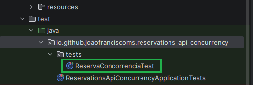
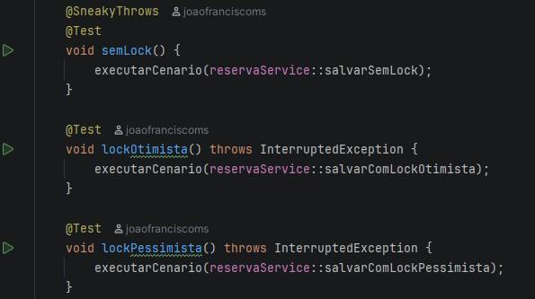
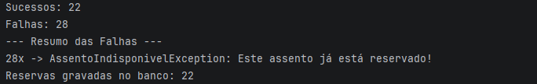
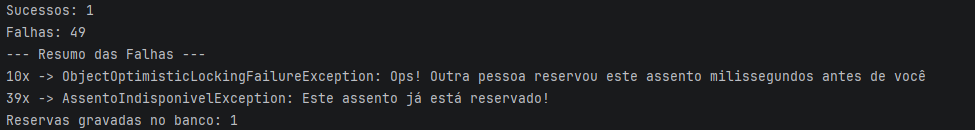
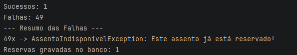
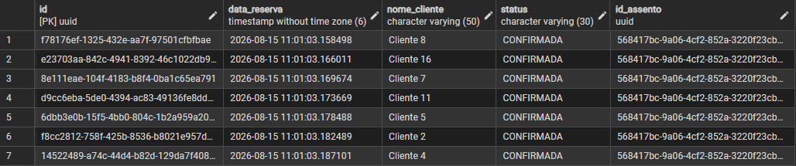
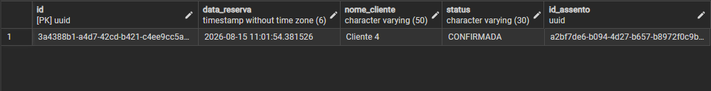

# Concorrencia - Spring Data JPA

API REST experimental criada para simular condições de corrida (Race Conditions), analisar cenários de Overbooking e demonstrar soluções práticas de concorrência utilizando Lock Otimista e Lock Pessimista no Spring Data JPA.

## Sobre o Projeto

Em sistemas de alta demanda (como venda de ingressos de shows, reservas de passagens ou e-commerce durante a Black Friday), múltiplos usuários tentam comprar ou alterar o mesmo recurso no exato mesmo milissegundo.

Sem o devido tratamento de concorrência na camada de persistência, ocorrem problemas graves de **integridade de dados**, como o *Overbooking* (vários clientes comprando o mesmo assento) e o *Lost Update* (uma alteração sobrescrevendo a outra silenciosamente).

Esta aplicação funciona como um **Sandbox/Benchmark interativo**, disponibilizando três estratégias de salvamento isoladas em endpoints dedicados para permitir a simulação e medição de testes de estresse em tempo real.

---

## Estratégias de Concorrência Analisadas

### 1. Sem Lock `/api/reservas/sem-lock`
* **Mecanismo:** Leitura e gravação padrão sem qualquer controle de versão ou bloqueio.
* **Comportamento sob Carga:** Múltiplas threads leem a entidade no banco ao mesmo tempo em estado `DISPONIVEL`. As validações de negócio passam para todas elas e múltiplos `INSERT`s/`UPDATE`s são confirmados no banco de dados.
* **Resultado:** **Vulnerável a Overbooking** (múltiplas reservas gravadas para um único assento).

### 2. Lock Otimista `/api/reservas/lock-otimista`
* **Mecanismo:** Utiliza a anotação `@Version` do JPA na entidade monitorada (`Assento`).
* **Comportamento sob Carga:** Não bloqueia a leitura no banco. Ao tentar realizar o `COMMIT`, o Hibernate compara a versão da entidade em memória com a versão atualizada no banco. Se outra thread alterou a versão nesse intervalo, uma `ObjectOptimisticLockingFailureException` é disparada.
* **Tratamento HTTP:** Mapeado no `@RestControllerAdvice` para retornar **`409 Conflict`**.
* **Resultado:** **100% Protegido**. Apenas 1 transação tem sucesso no commit; as colisões simultâneas são abortadas e tratadas.

### 3. Lock Pessimista `/api/reservas/lock-pessimista`
* **Mecanismo:** Utiliza `@Lock(LockModeType.PESSIMISTIC_WRITE)` executando um `SELECT ... FOR UPDATE` no banco de dados.
* **Comportamento sob Carga:** Bloqueia a linha da tabela (`row-level lock`) assim que a primeira thread faz a leitura. As demais threads aguardam na fila até que a primeira transação finalize o `COMMIT` ou `ROLLBACK`.
* **Tratamento HTTP:** A primeira thread reserva o assento; as threads seguintes na fila leem o assento já atualizado como `RESERVADO` e falham na validação de negócio com **`422 Unprocessable Entity`**.
* **Resultado:** **100% Protegido**. Garante fila ordenada de execução diretamente no banco de dados.

---

## Tecnologias Utilizadas

- Java 21
- Spring Boot 4.1.0 (Spring Framework 7)
- Spring Data JPA
- PostgreSQL
- Maven

---

## Pré-Requisitos

Antes de começar, tenha instalado em sua máquina:

- [Java 21] ou superior
- [Maven] (ou use o wrapper `./mvnw` incluso no projeto)
- [PostgreSQL] instalado e em execução
- Uma IDE de sua preferência (o projeto foi desenvolvido usando IntelliJ, mas qualquer uma com suporte a Java/Maven funciona)

---

## Como Executar o Projeto

1. Clone o repositório:
```
git clone https://github.com/joaofranciscoms/reservas-api-concorrencia.git
```

2. Crie um banco de dados no PostgreSQL chamado `reservations-platform`.

3. Configure as credenciais de acesso ao banco no arquivo `src/main/resources/application.yml`:
```yaml
spring:
  datasource:
    url: jdbc:postgresql://localhost:5432/reservations-platform
    username: seu_usuario
    password: sua_senha
```

4. Abra o projeto na sua IDE e aguarde a instalação automática das dependências via Maven.

5. Execute a classe principal (a que contém o método `main`) para subir a aplicação.

A API estará disponível em `http://localhost:8080`.

---

## Testando via JUnit (Sem Lock, Lock Otimista, Lock Pessimista)

Com a aplicação já configurada (não é necessário estar rodando para este método, os testes sobem seu próprio contexto):

1. Acesse a classe de testes, localizada no pacote `test`, logo abaixo do pacote `resources`.



2. Execute um dos métodos de teste conforme o cenário desejado: `semLock`, `lockOtimista` ou `lockPessimista`.



O resultado aparece no log ao final da execução:

**Sem Lock**



**Lock Otimista**



**Lock Pessimista**



Também é possível acompanhar o resultado diretamente no banco de dados:

**Sem Lock**



**Lock Otimista ou Pessimista**



---

## Tabela Comparativa de Resultados (Benchmark)

Resultados obtidos ao disparar uma bateria de **50 Threads simultâneas** direcionadas para o mesmo assento:

| Estratégia | Trava Utilizada | Carga Simultânea (Quantidade de Threads) | Reservas Gravadas no Banco | Status HTTP Retornados | Diagnóstico da Aplicação |
| :--- | :--- | :--- | :--- | :--- | :--- |
| **Sem Lock** | Nenhuma | 50 | **20+ (Overbooking)** | `201 Created` (múltiplos) | **Falha de Integridade:** Leituras sujas paralelas permitiram reservas duplicadas. |
| **Lock Otimista** | `@Version` | 50 | **1 (Sucesso)** | `201 Created` (1x)<br>`409 Conflict` (colisões)<br>`422 Unprocessable` (regra) | **Sucesso:** As colisões exatas no commit dispararam 409 e o restante foi barrado por regra de negócio. |
| **Lock Pessimista** | `FOR UPDATE` | 50 | **1 (Sucesso)** | `201 Created` (1x)<br>`422 Unprocessable` (49x) | **Sucesso:** A trava de linha enfileirou as requisições e as demais caíram na validação de assento indisponível. |

---
